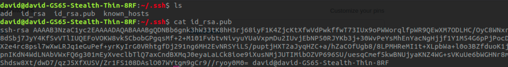
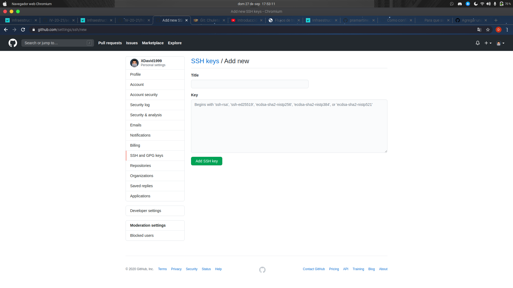
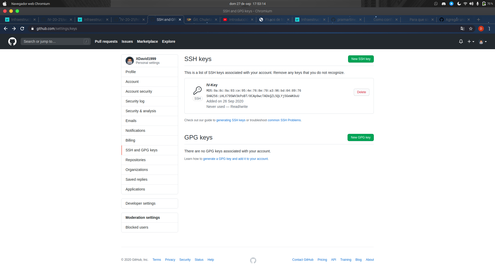
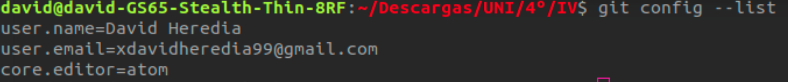

# Configurando git y GitHub

## Conectando nuestro PC y GitHub

### Creación de par de claves pública/privada

En primer lugar, y para trabajar más cómodamente configuraremos desde la terminal un par de claves pública/privada para no tener que escribir repetitivamente nuestras credenciales al trabajar entre nuestro equipo y nuestro servicio remoto. Para ello usamos el comando ssh-keygen, generándose ambas claves.

### Usando las claves en GitHub

En la captura podemos ver un listado del directorio **~/.ssh**, en el cual se guardan las claves ssh del usuario. La clave que se muestra con **cat** es la pública creada, la cual copiaremos en configuración -> settings -> SSH and GPG keys -> new SSH key -> key.

## Configuración de git para nuestro usuario

Siguiendo un tutorial en [esta página](https://git-scm.com/book/es/v2/Inicio---Sobre-el-Control-de-Versiones-Configurando-Git-por-primera-vez) configuramos de forma sencilla algunas de las principales variables relevantes que necesitaremos: nombre, email y editor.

Utilizando el comando **git config --list** podemos ver como queda:

Hecho esto, podremos trabajar de forma sencilla con git y GitHub.
