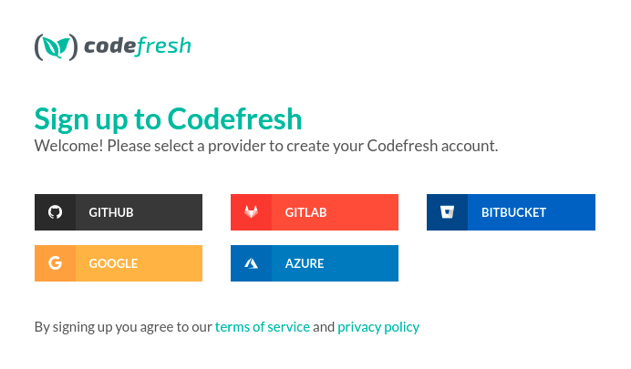
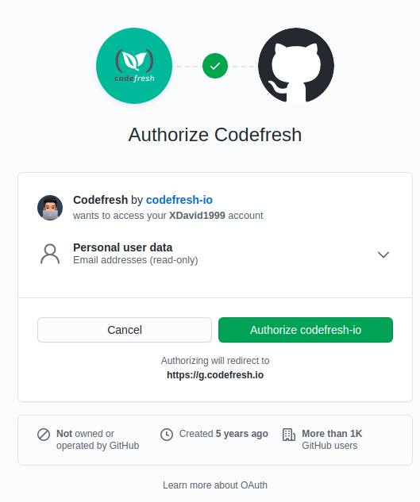
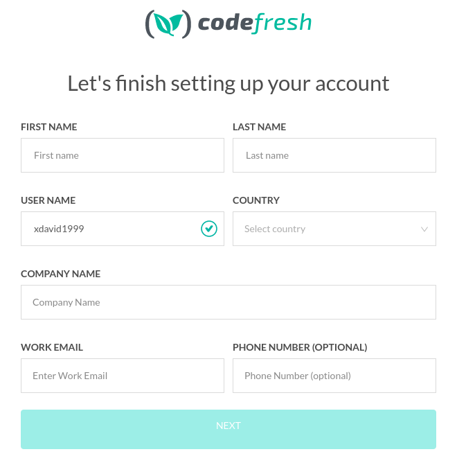
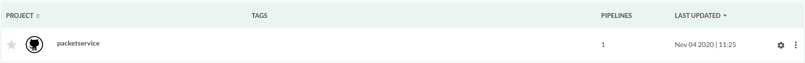
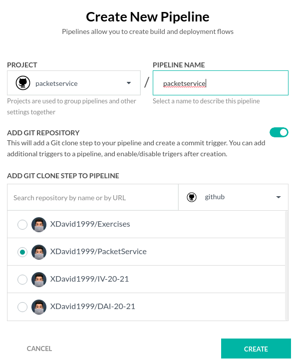

# Integraciíon continua

La integración continua es una práctica con la que se realizan integraciones automáticas en un proyecto en periodos de timepo cortos para así poder detectar fallos cuanto antes. Entendemos por integración la compilación y el testeo de todo un proyecto.

El proceso, en nuestro caso, se repite cada vez que realizamos cambios en el proyecto (commits) para ver si todo continúa funcionando correctamente. Lo que en este caso harán nuestros CI será acceder a nuestro repositorio, clonarlo, crear un contenedor según se ha especificado en nuestro Dockerfile y ejecutar los test que se hayan programado para el código desarrollado. Si todo este proceso se desarrolla con normalidad se nos informará de que el proyecto funciona correctamente, en caso contrario se nos notificarán errores.

Para este proceso usaremos Travis y CodeFresh.

## Travis

### Justificación

Travis es una herramienta para la integración continua muy conocida y utilizada en la realización de proyectos. Una de suss claras ventajas es que permite conectar nuestro repositorio de Github y hacer pruebas después de cada push que realicemos. Travis además, soporta una gran cantidad de lenguajes como Clojure, Erlang, Node.js, PHP, Ruby, etc. 

Podemos destacar también es que el entorno de integración continua esta compuesto de multiples runtimes (Node.js, o versiones de PHP, por ejemplo) o data stores. De este modo, podemos hacer pruebas a nuestras librerías o aplicaciones usando distintas configuraciones sin tener que tenerlas instaladas localmente.

La integración con Github es extremadamente sencilla como veremos más adelante ya que practicamente solo necesitamos darle acceso de lectura a nuestro código y definir los test necesarios. Asimismo, la documentación es clara y detallada para cada proceso, así como las herramientas de terceros y recursos.

### Configuración

La parte de la configuración de esta herrammienta está detallada en los ejercicios [9](https://github.com/XDavid1999/Exercises/blob/master/Ejercicios/ejercicio9/ejercicio9.md) y [10](https://github.com/XDavid1999/Exercises/blob/master/Ejercicios/ejercicio10/ejercicio10.md) necesarios para la realización del hito 4. En el primero se explica como hemos conectado Travis y nuestro proyecto en GitHub y en el segundo se describe el fichero .travis.yml y como se ha configurado.

## Code Fresh

### Justificación

En principio [codefresh](https://codefresh.io) se define como la plataforma de automatización de DevOps número uno para aplicaciones de Kubernetes. Elegimos esta herramienta buscando en la web. Dentro de las que se consideraron posibles codefresh, además de no haber sido tan usada por los compañeros, tiene una extensa documentación. 

En su propia página podemos encontrar ayuda acerca de como realizar flujos de trabajo o como automatizar infinidad de tareas acompañadas de una explicación de por qué se ejecuta practicamente cada linea de código. 

Además de esto, esta utilidad es extremadamente versátil, ya que se puede integrar con muchas plataformas y los tiempos de espera son bastante cortos. Codefresh también nos proporciona estadísticas e información relevante acerca de la memoria que se está utilizando, logs, etc. Sumado a todo esto el uso de la herramienta no es excesivamente complicado y su interfaz es vistosa e intuitiva.

### Configuración

- Iremos a la página de registro de codefresh y crearemos una nueva cuenta. Dentro de esta, para registrarnos, usaremos un "proveedor de identidad".

- Después de seleccionar el proveedor de identidad, Codefresh no solicitará permiso para acceder a sus detalles básicos y necesarios para integrar Github y CodeFresh.

- Después de esto se nos presentará una pantalla en la que se verificarán los datos de nuestra cuenta. Una vez que Codefresh lea sus datos de nuestro proveedor de identidad, GitHub, nos presentará los datos de nuestra nueva cuenta.

- Una vez registrados, y configurada nuestra cuenta, procederemos a crear un nuevo proyecto en codefresh. Estableceremos como nombre el de nuestra app.

- Dentro del proyecto crearemos una nueva pipeline. Los pipeline son un conjunto de prácticas para incorporar la automatización y el control permanente en todo el ciclo de vida en el desarrollo de nuestra app.

- Para que la pipeline funcione correctamente tendremos que crear un workflow correcto en el archivo yaml de esta. Lo que haremos en este será clonar nuestro repositorio, crear una imagen con el dockerfile en nuestro repositorio GitHub y ejecutar *gulp test* dentro del contenedor creado. Este es nuestro archivo .yaml resultante: 

~~~
# More examples of Codefresh YAML can be found at# More examples of Codefresh YAML can be found at
# https://codefresh.io/docs/docs/yaml-examples/examples/

version: "1.0"
# Stages can help you organize your steps in stages
stages:
  - "clone"
  - "build"
  - "test"

steps:
  clone:
    title: "Cloning repository"
    type: "git-clone"
    repo: "XDavid1999/PacketService"
    # CF_BRANCH value is auto set when pipeline is triggered
    # Learn more at codefresh.io/docs/docs/codefresh-yaml/variables/
    revision: "${{CF_BRANCH}}"
    git: "github"
    stage: "clone"

  build:
    title: "Building Docker image"
    type: "build"
    image_name: "XDavid1999/PacketService"
    working_directory: "${{clone}}"
    tag: "${{CF_BRANCH_TAG_NORMALIZED}}"
    dockerfile: "Dockerfile"
    stage: "build"

  test:
    title: "Running test"
    type: "freestyle" # Run any command
    image: "${{build}}" # The image in which command will be executed
    working_directory: "${{clone}}" # Running command where code cloned
    commands:
      - "gulp test"
    stage: "test"
~~~

-  Los disparadores, que son los eventos por los cuales se "ejecutará" esta pipe, pueden ser configurados también aunque no será necesario, ya que por defecto tenemos un trigger cada vez se que se realicen un commits.